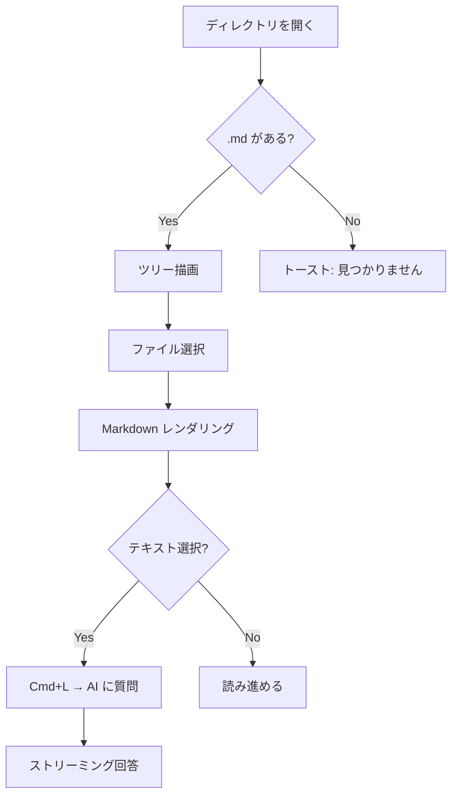
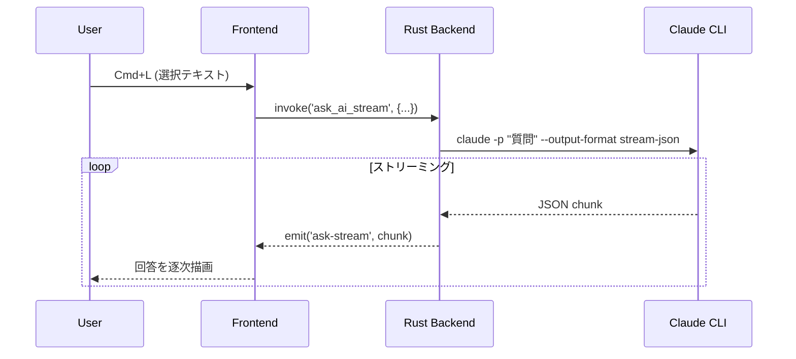
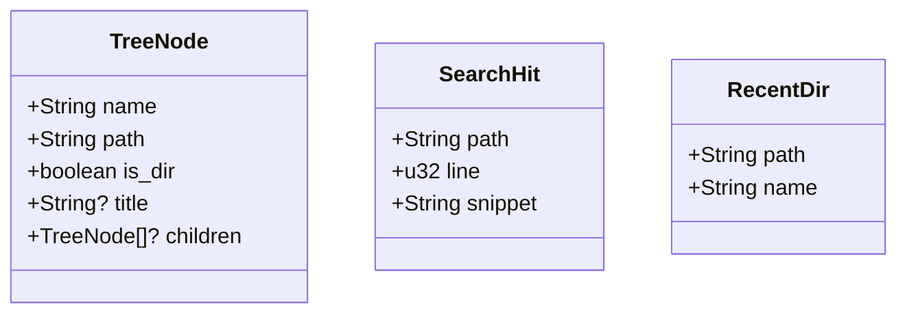
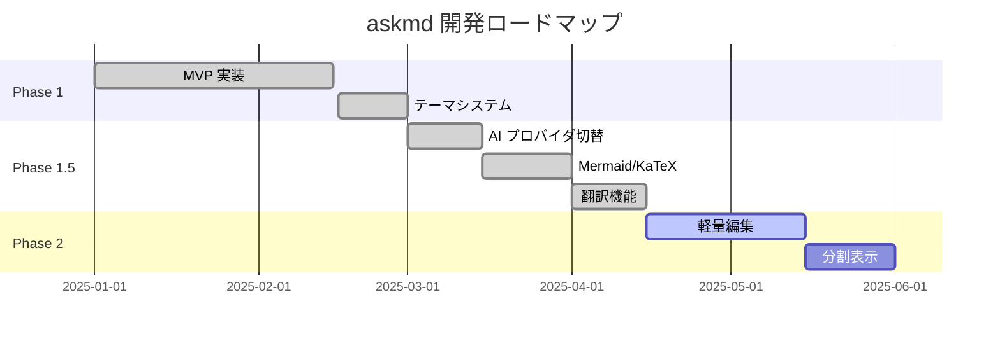

# Mermaid ダイアグラム

## フローチャート

```mermaid
flowchart TD
    A[ディレクトリを開く] --> B{.md がある?}
    B -->|Yes| C[ツリー描画]
    B -->|No| D[トースト: 見つかりません]
    C --> E[ファイル選択]
    E --> F[Markdown レンダリング]
    F --> G{テキスト選択?}
    G -->|Yes| H[Cmd+L → AI に質問]
    G -->|No| I[読み進める]
    H --> J[ストリーミング回答]
```

## シーケンス図

```mermaid
sequenceDiagram
    participant U as User
    participant F as Frontend
    participant R as Rust Backend
    participant C as Claude CLI

    U->>F: Cmd+L (選択テキスト)
    F->>R: invoke('ask_ai_stream', {...})
    R->>C: claude -p "質問" --output-format stream-json
    loop ストリーミング
        C-->>R: JSON chunk
        R-->>F: emit('ask-stream', chunk)
        F-->>U: 回答を逐次描画
    end
```

## クラス図

```mermaid
classDiagram
    class TreeNode {
        +String name
        +String path
        +boolean is_dir
        +String? title
        +TreeNode[]? children
    }
    class SearchHit {
        +String path
        +u32 line
        +String snippet
    }
    class RecentDir {
        +String path
        +String name
    }
```

## ガントチャート

```mermaid
gantt
    title askmd 開発ロードマップ
    dateFormat YYYY-MM-DD
    section Phase 1
        MVP 実装          :done, 2025-01-01, 2025-02-15
        テーマシステム      :done, 2025-02-16, 2025-03-01
    section Phase 1.5
        AI プロバイダ切替   :done, 2025-03-01, 2025-03-15
        Mermaid/KaTeX      :done, 2025-03-15, 2025-04-01
        翻訳機能           :done, 2025-04-01, 2025-04-15
    section Phase 2
        軽量編集            :active, 2025-04-15, 2025-05-15
        分割表示            :2025-05-15, 2025-06-01
```
